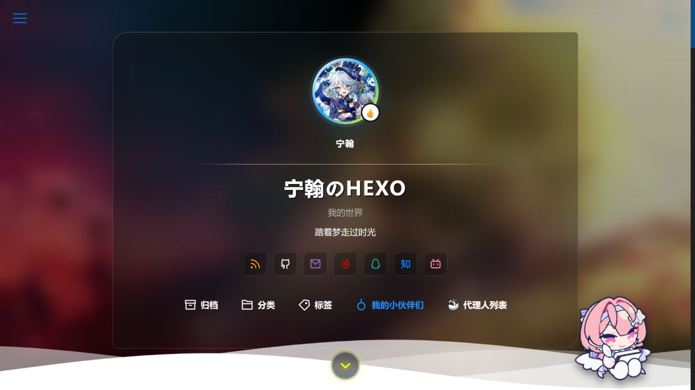
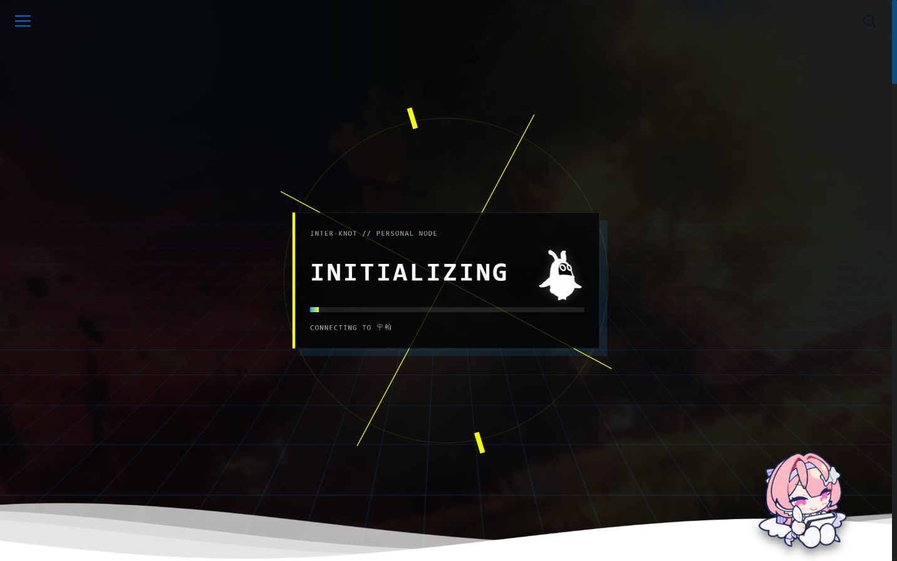
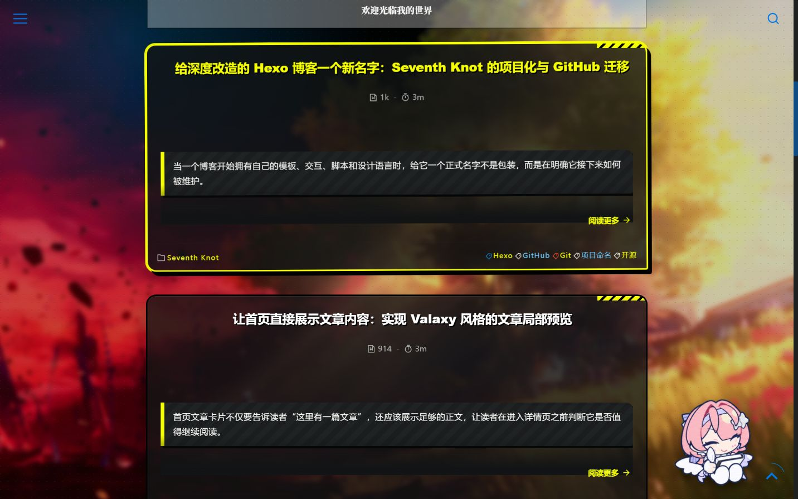
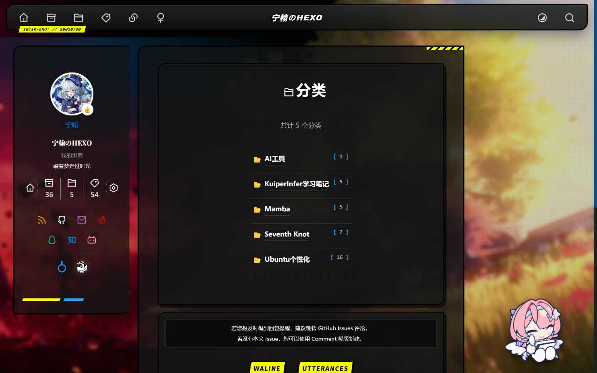
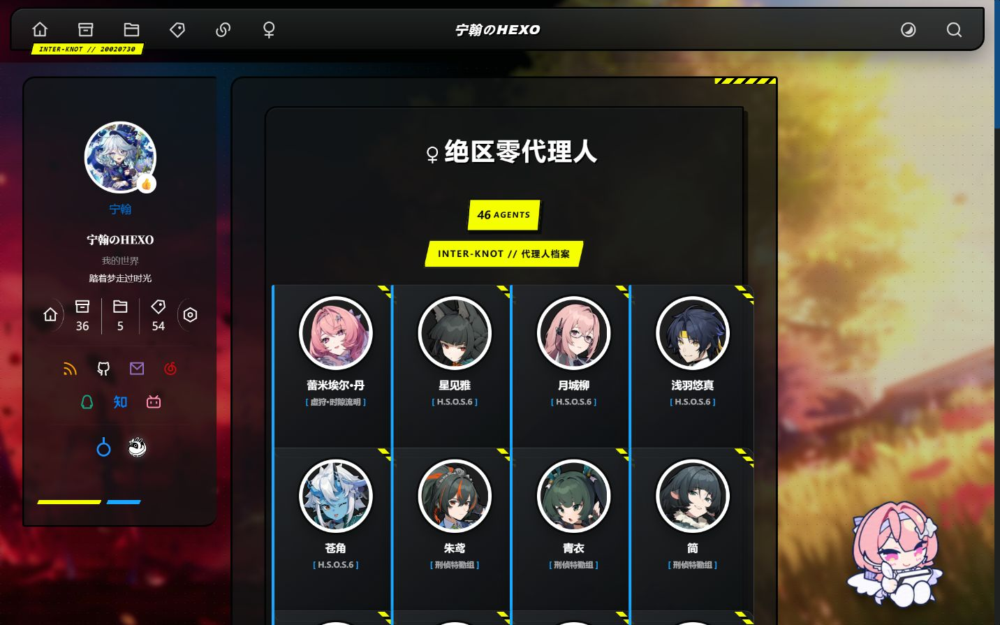
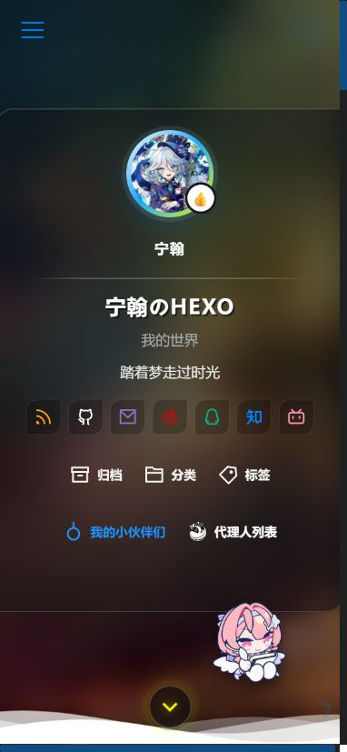
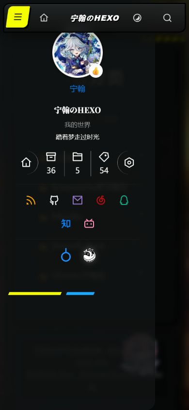
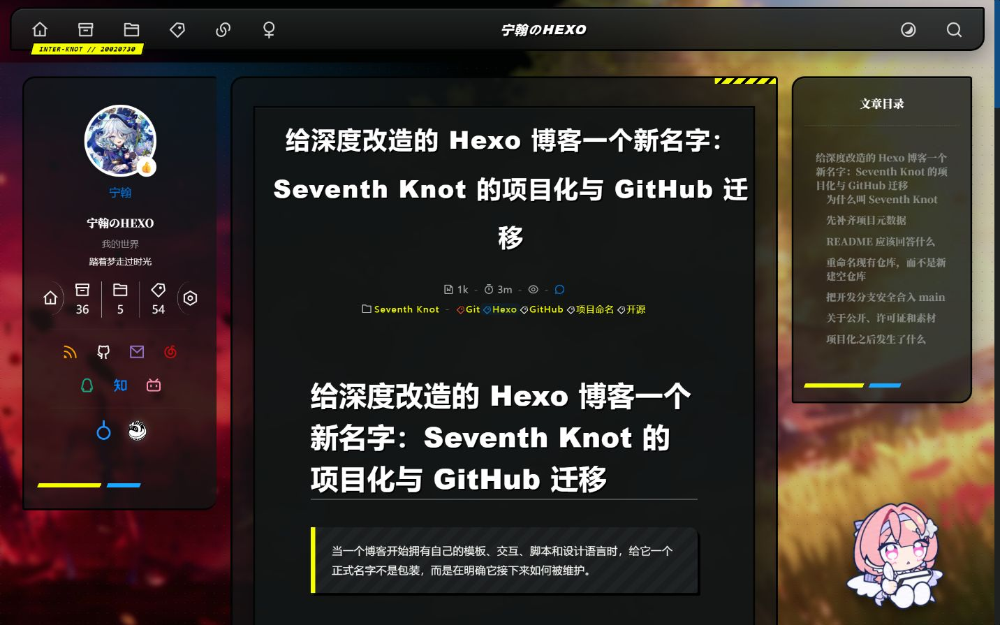
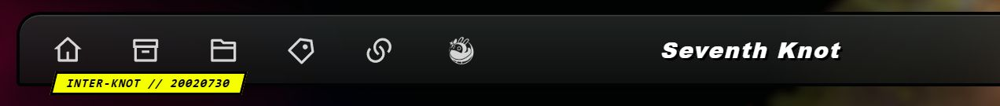
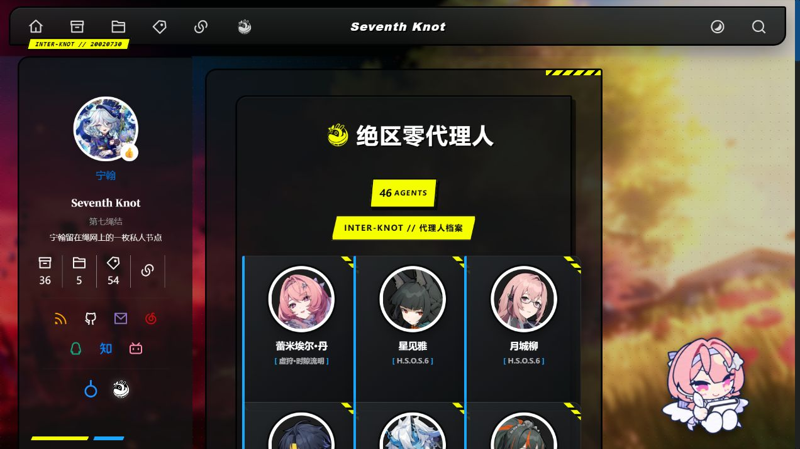

# Seventh Knot · 第七绳结

> 世界需要七休日，而这里是宁翰留在绳网上的一枚私人节点。

**Seventh Knot** 是一个基于 [Hexo](https://hexo.io/) 与 [Theme Yun](https://github.com/YunYouJun/hexo-theme-yun) 深度改造的个人博客项目。它将 Valaxy 式的首页叙事、Inter-Knot 风格视觉、两段式开场动画与移动端阅读体验组合在同一个站点中。

站点地址：[https://20020730.xyz](https://20020730.xyz)

GitHub 仓库：[Wanglihan954/seventh-knot](https://github.com/Wanglihan954/seventh-knot) — 查看源代码、提交记录与后续更新。

## 运行截图

以下画面由本地运行的 Hexo 站点实际截取，不是设计稿。



| 首页加载阶段 | 首页文章卡片 |
| --- | --- |
|  |  |

| 分类页 | 代理人档案页 |
| --- | --- |
|  |  |

| 移动端首页 | 移动端导航 |
| --- | --- |
|  |  |



| 配置化导航栏 | 邦布代理人档案页 |
| --- | --- |
|  |  |

## 项目特色

- 两段式首页：原版 Yun 文字动画结束后进入加载阶段，再展示个人主页
- Inter-Knot 风格：工业面板、扫描线、网格、警示色和终端式界面
- 邦布加载动画：在第二段首页出现前与进度条共同播放
- 云雾过渡：加载阶段和个人主页阶段保留动态云层
- 文章局部预览：首页直接展示文章片段，并提供渐隐和阅读全文入口
- 移动端适配：针对窄屏重新设计导航、首页布局、文章卡片和触控区域
- 个性化组件：网页宠物、代理人列表、社交入口和自定义侧边栏
- 配置化导航：名称、标牌、链接顺序和图标均可在 `_config.yun.yml` 中维护
- 笔记迁移：支持将本地 Markdown 笔记整理为 Hexo 文章

## 导航栏配置

顶部导航统一由 `_config.yun.yml` 的 `menu` 配置控制。`brand` 和 `badge` 对应中央名称与黄色标牌，`home` 和 `list` 管理左侧入口，`actions` 管理主题切换和搜索按钮。

导航图标支持 Iconify 的 `icon`、保留原色的 `image`，以及跟随导航颜色的 `mask_image`。完整配置方法与实现说明见文章[《从硬编码到配置驱动：用 _config.yun.yml 管理 Seventh Knot 导航栏》](https://20020730.xyz/posts/7c4e2b91/)。

## 技术栈

- Hexo 8
- Theme Yun 1.10.11
- Pug
- CSS / JavaScript
- GitHub Pages / 自定义域名

## 本地运行

环境要求：Node.js `20.19.0` 或更高版本。

```bash
git clone git@github.com:Wanglihan954/seventh-knot.git
cd seventh-knot
npm install
npm run server
```

浏览器访问 Hexo 输出的本地地址，通常为 `http://localhost:4000`。

## 常用命令

```bash
# 启动本地预览
npm run server

# 清理生成缓存
npm run clean

# 生成静态站点
npm run build

# 按 _config.yml 的部署配置发布
npm run deploy
```

## 目录说明

```text
.
├─ source/
│  ├─ _posts/              # 博客文章
│  ├─ css/                 # 自定义主题样式
│  ├─ images/              # 图片、动画与运行截图
│  └─ js/                  # 首页、移动导航和网页宠物脚本
├─ themes/yun/
│  ├─ layout/              # 深度修改后的 Pug 模板
│  └─ scripts/helpers/     # 文章预览等 Hexo Helper
├─ _config.yml             # Hexo 配置
└─ _config.yun.yml         # Theme Yun 与站点个性化配置
```

## 写作约定

文章放置于 `source/_posts/`，使用 Hexo Front Matter：

```yaml
---
title: 文章标题
date: 2026-08-12 12:00:00
categories:
  - 分类
tags:
  - 标签
---
```

首页摘要会从正文中提取内容；文章需要精确控制预览边界时，可以加入 `<!-- more -->`。

## 项目定位

Seventh Knot 不是一个全新的静态站点生成器，而是一个具有独立设计语言、交互流程和内容体系的 Hexo 博客项目。它保留 Hexo 与 Theme Yun 的基础能力，同时维护自己的模板、样式和脚本。

## 致谢与版权

- 博客生成器：[Hexo](https://github.com/hexojs/hexo)
- 上游主题：[Theme Yun](https://github.com/YunYouJun/hexo-theme-yun)，遵循其 MIT License
- 设计灵感：[Valaxy](https://github.com/YunYouJun/valaxy) 与《绝区零》Inter-Knot 视觉体系

《绝区零》、邦布及相关游戏素材的著作权与商标权归其权利人所有。本项目为非官方个人博客，与米哈游无隶属或合作关系。文章内容及个人原创资源未经许可请勿转载；第三方代码与资源分别遵循其原始许可。
