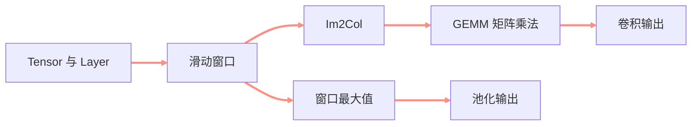
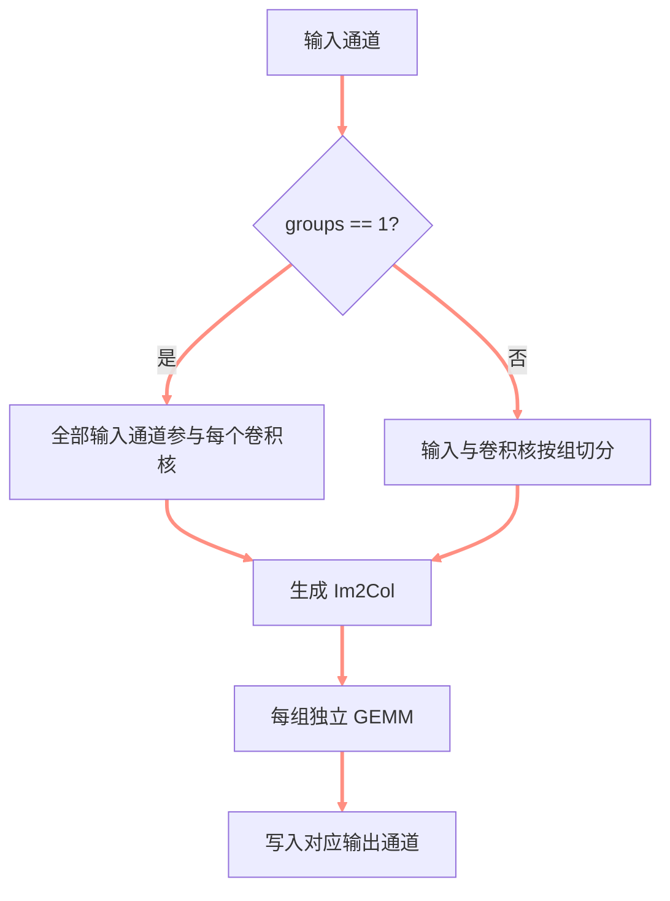

> **课程信息**
> **课程：** 自制深度学习推理框架
> **章节：** 卷积、Im2Col 与最大池化
> **官方视频：** [第六讲 卷积和池化算子的实现](https://www.bilibili.com/video/BV1hx4y197dS)
> **配套源码：** [kuiperdatawhale/course6](https://github.com/zjhellofss/kuiperdatawhale/tree/main/course6)
> **学习状态：** learning


<!-- more -->

## 🎯 本节目标

- [ ] 能根据输入、卷积核、步长和填充计算输出形状。
- [ ] 理解为什么使用 Im2Col 将卷积转化为矩阵乘法。
- [ ] 理解普通卷积、分组卷积和偏置的代码路径。
- [ ] 能独立说明最大池化的滑窗计算与参数解析。

## 🧭 课程脉络




**本节要解决的问题：**

> 如何把卷积和池化从数学定义落到统一的 Layer 接口中，并让注册器根据 PNNX 参数创建正确的算子？

---

## 📚 课堂笔记

### 1. 卷积输出形状

对二维输入，高和宽分别满足：

$$
H_{out}=\left\lfloor\frac{H_{in}+2P_h-K_h}{S_h}\right\rfloor+1
$$

$$
W_{out}=\left\lfloor\frac{W_{in}+2P_w-K_w}{S_w}\right\rfloor+1
$$

在源码中对应：

```cpp
const uint32_t output_h =
    std::floor((int(input_padded_h) - int(kernel_h)) / stride_h_ + 1);
const uint32_t output_w =
    std::floor((int(input_padded_w) - int(kernel_w)) / stride_w_ + 1);
```

> **我的理解**
> padding 先扩大可滑动区域，kernel 决定窗口大小，stride 决定窗口每次移动多远。

### 2. Im2Col：把窗口展开成列

直接卷积需要多层循环。KuiperInfer 先把每个感受野展开成一列：

```text
输入 Tensor
    ↓ 提取每个滑窗
Im2Col 矩阵
[Cin × Kh × Kw, Hout × Wout]
    ↓
卷积核矩阵
[Cout, Cin × Kh × Kw]
    ↓ GEMM
输出矩阵
[Cout, Hout × Wout]
```

矩阵关系可以写成：

$$
Y = W \times X_{col} + b
$$

其中：

- $X_{col}$：所有输入滑窗；
- $W$：展开后的卷积核；
- $b$：每个输出通道的偏置；
- $Y$：待恢复为输出 Tensor 的矩阵。

源码中的关键计算是：

```cpp
output = kernel * input_matrix + bias_value;
```

这种实现会增加临时内存，但能利用 Armadillo/OpenBLAS 的高效矩阵乘法。

### 3. Padding、Stride 与 Group




分组卷积要求：

```cpp
CHECK(kernel_count % groups_ == 0);
CHECK(input_c % groups_ == 0);
```

每组只读取自己的输入通道，并写入自己的输出通道范围。普通卷积就是 `groups = 1` 的特例。

### 4. 最大池化

最大池化没有权重，只在每个窗口中取最大值：

$$
y_{c,i,j}=\max_{(u,v)\in window}x_{c,u,v}
$$

它不会混合不同通道：

```text
每个输入通道
    ↓ 独立滑窗
窗口内取最大值
    ↓
对应输出通道
```

例如输入：

```text
1 2 3 4
2 3 4 5
3 4 5 6
4 5 6 7
```

使用 `2×2` kernel、`stride=2` 后得到：

```text
3 5
5 7
```

### 5. 从 PNNX 参数创建 Layer

卷积层需要解析：

- `in_channels`、`out_channels`
- `kernel_size`
- `stride`
- `padding`
- `groups`
- `bias`
- `weight` 与可选 `bias` 属性

池化层需要解析：

- `kernel_size`
- `stride`
- `padding`

创建完成后分别注册为：

```cpp
LayerRegistererWrapper kConvGetInstance(
    "nn.Conv2d", ConvolutionLayer::GetInstance);

LayerRegistererWrapper kMaxPoolingGetInstance(
    "nn.MaxPool2d", MaxPoolingLayer::GetInstance);
```

---

## 🧪 实践与验证

### 练习 1｜卷积前向

**输入：** 两个通道的 `4×4` Tensor、两个 `3×3` 卷积核。
**参数：** `padding=0`、`stride=1`。
**预期输出：** `2×2×2`。

实际两个输出通道均为：

```text
220 256
364 400
```

### 练习 2｜池化创建与前向

注册器成功根据 `nn.MaxPool2d` 创建 Layer；`4×4` 输入得到预期的 `2×2` 输出。

> **运行结果**
> 第 6 课官方 Google Test 共 **3 项，全部通过**。

---

## 🧠 核心概念

| 概念 | 一句话解释 | 在框架中的用途 | 掌握情况 |
| --- | --- | --- | --- |
| Im2Col | 把滑窗区域展开为矩阵列 | 将卷积转为 GEMM | 🟡 |
| GEMM | 通用矩阵乘法 | 利用 BLAS 加速 | 🟡 |
| Group | 按组隔离输入与输出通道 | 支持分组卷积 | 🟡 |
| MaxPooling | 窗口内取最大值 | 下采样、保留强响应 | 🟡 |
| GetInstance | 解析参数并创建 Layer | 接入算子注册器 | 🟡 |

> **掌握标记**
> 🔴 不理解 · 🟡 能复述 · 🟢 能独立使用

## 🔗 知识联系

```text
第 2 课 Tensor 存储
    ↓
第 5 课 Layer 与注册器
    ↓
第 6 课可执行的 Conv / MaxPool
    ↓
第 8 课完整 ResNet 推理
```

---

## ⚠️ 易错点

### 1. 混淆 Tensor 中的 rows/cols 与图像高宽

先确认项目的内存布局与 API 约定，再代入输出形状公式。

### 2. 忘记检查 stride 为零

`stride=0` 不仅公式非法，滑窗循环也无法前进。

### 3. Im2Col 展开顺序和权重展开顺序不同

两边顺序必须完全一致，否则形状正确但数值错误。

### 4. 忽略 group 的通道偏移

每组的输入通道、卷积核和输出通道都必须使用对应起始位置。

---

## ❓ 待解决问题

- [ ] 手算一个带 padding 的 `3×3` 卷积。
- [ ] 比较直接卷积与 Im2Col 的时间和额外内存。
- [ ] 独立实现 AveragePooling 并注册。

## 📝 课后自测

### Q1｜输入 `3×32×32`，卷积核 `16×3×3×3`，padding=1、stride=2，输出是什么形状？

>

### Q2｜Im2Col 为什么更快，又为什么更占内存？

>

### Q3｜最大池化为什么不需要 ParamLayer？

>

---

## ✅ 本节总结

1. 卷积输出形状由输入、kernel、padding 和 stride 共同决定。
2. Im2Col 将卷积窗口展开，通过 GEMM 统一完成计算。
3. 最大池化是无参数滑窗算子，但仍需完整处理形状和边界。

**一句话总结：**

> 第 6 课把 Layer 抽象落成真正的数值算子，为完整 CNN 网络前向执行补上核心计算能力。

## 🚀 下一步

**下一节：** 

- [ ] 2026-09-02：第一次复习
- [ ] 2026-09-08：第二次复习
- [ ] 2026-10-01：第三次复习
