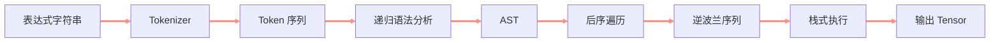
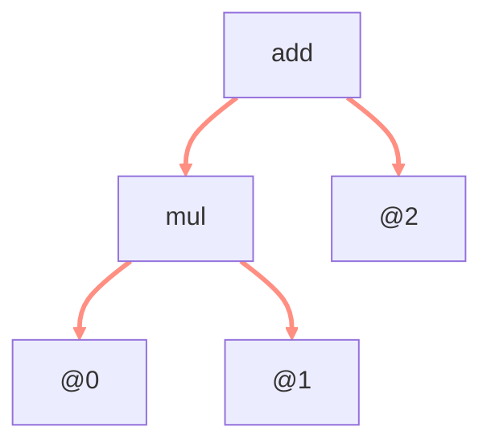
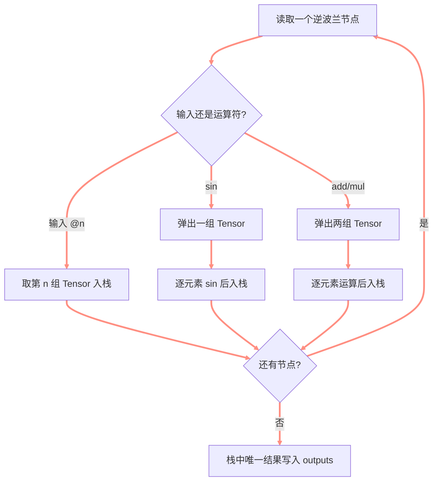

> **课程信息**
> **课程：** 自制深度学习推理框架
> **章节：** 表达式解析与执行
> **官方视频：** [第七讲 表达式层中词法分析和语法分析以及算子的实现](https://www.bilibili.com/video/BV1j8411o7ao)
> **配套源码：** [kuiperdatawhale/course7](https://github.com/zjhellofss/kuiperdatawhale/tree/main/course7)
> **学习状态：** learning


<!-- more -->

## 🎯 本节目标

- [ ] 区分词法分析、语法分析和表达式执行。
- [ ] 能把 `add(@0,mul(@1,@2))` 拆成 Token。
- [ ] 能画出抽象语法树，并解释后序遍历为何得到逆波兰式。
- [ ] 能使用栈执行 `add`、`mul` 和 `sin`。

## 🧭 课程脉络




**本节要解决的问题：**

> PNNX 把残差加法等操作保存为字符串表达式，推理框架如何把字符串变成可执行的 Tensor 运算？

---

## 📚 课堂笔记

### 1. 表达式语言

课程中的最小表达式语言支持：

| 写法 | 含义 |
| --- | --- |
| `@0`、`@1` | 第 0、1 个输入 |
| `add(a,b)` | 两个 Tensor 逐元素相加 |
| `mul(a,b)` | 两个 Tensor 逐元素相乘 |
| `sin(a)` | 对 Tensor 逐元素求正弦 |

例如：

```text
add(@0,mul(@1,@2))
```

表示：

$$
output = input_0 + input_1 \times input_2
$$

### 2. 词法分析 Tokenizer

Tokenizer 只负责回答：

> 字符串中有哪些“词”，每个词属于什么类型？

```text
add ( @0 , mul ( @1 , @2 ) )
 ↓  ↓  ↓  ↓  ↓   ↓  ↓  ↓  ↓  ↓  ↓
Add ( In , Mul  ( In , In )  )
```

核心类型定义：

```cpp
enum class TokenType {
  TokenUnknown = -9,
  TokenInputNumber = -8,
  TokenComma = -7,
  TokenAdd = -6,
  TokenMul = -5,
  TokenLeftBracket = -4,
  TokenRightBracket = -3,
  TokenSin = -2,
};
```

每个 Token 记录类型和在原字符串中的 `[start_pos, end_pos)`。

> **我的理解**
> 词法分析只识别积木；它还不知道这些积木最终组成什么结构。

### 3. 递归构建抽象语法树

对表达式：

```text
add(mul(@0,@1),@2)
```

AST 为：




`Generate_(index)` 根据当前 Token 递归处理：

- 输入编号：生成叶子节点；
- `sin`：读取一个子表达式；
- `add` / `mul`：读取左子表达式、逗号和右子表达式；
- 每次都检查括号和操作数是否完整。

### 4. 从 AST 到逆波兰表达式

对 AST 做后序遍历：

```text
左子树 → 右子树 → 当前节点
```

上面的表达式会变成：

```text
@0 @1 mul @2 add
```

运算符总在操作数之后，所以不再需要括号，适合使用栈执行。

### 5. 使用栈执行 Tensor 表达式




关键容器：

```cpp
std::stack<
    std::vector<std::shared_ptr<Tensor<float>>>
> op_stack;
```

栈中的一个元素不是单个 Tensor，而是一个 batch 的 Tensor 数组。

### 6. 输入索引与 batch 布局

表达式叶子节点保存 `@n` 的编号。源码通过：

```cpp
uint32_t start_pos = token_node->num_index * batch_size;
```

找到该输入在扁平 `inputs` 中的起始位置，再取连续 `batch_size` 个 Tensor。

因此必须先明确输入布局：

```text
@0 的 batch0, batch1, ...
@1 的 batch0, batch1, ...
@2 的 batch0, batch1, ...
```

### 7. Expression Layer 注册

`GetInstance` 从 RuntimeOperator 参数中读取表达式字符串，然后创建：

```cpp
expression_layer =
    std::make_shared<ExpressionLayer>(statement_param->value);
```

注册键：

```cpp
LayerRegistererWrapper kExpressionGetInstance(
    "pnnx.Expression", ExpressionLayer::GetInstance);
```

---

## 🧪 实践与验证

### 练习 1｜基础表达式

```text
mul(@2,add(@0,@1))
```

当 `@0=2`、`@1=3`、`@2=4` 时：

```text
4 × (2 + 3) = 20
```

测试验证输出 Tensor 的所有元素均为 20。

### 练习 2｜一元 sin

```text
mul(@1,sin(@0))
```

当 `@0=2`、`@1=3` 时，预期为：

```text
3 × sin(2)
```

测试使用误差阈值 `1e-3` 比较结果。

> **运行结果**
> 第 7 课官方 Google Test 共 **8 项，全部通过**：6 项 Parser 测试和 2 项 Expression 前向测试。

---

## 🧠 核心概念

| 概念 | 一句话解释 | 在框架中的用途 | 掌握情况 |
| --- | --- | --- | --- |
| Token | 带类型和位置的最小词法单元 | 保存解析结果 | 🟡 |
| Tokenizer | 字符串到 Token 序列 | 词法分析 | 🟡 |
| AST | 表达式的树状结构 | 表示运算依赖 | 🟡 |
| 逆波兰式 | 运算符位于操作数之后 | 简化执行 | 🟡 |
| 操作数栈 | 暂存输入和中间结果 | 执行表达式 | 🟡 |

## 🔗 知识联系

```text
第 3～4 课计算图
    ↓
PNNX Expression 节点
    ↓
本课字符串解析与栈式执行
    ↓
第 8 课 ResNet 残差相加
```

---

## ⚠️ 易错点

### 1. 把 Token 序列当成语法树

Token 只说明“有什么”，AST 才说明“谁是谁的操作数”。

### 2. 逆波兰遍历顺序写成根、左、右

应使用后序遍历：左、右、根。

### 3. 二元运算弹栈顺序不明确

加法和乘法可交换，但以后加入减法、除法时必须保留左右操作数顺序。

### 4. 忘记最终栈只能剩一个结果

多个结果说明表达式不完整或执行逻辑遗漏。

---

## ❓ 待解决问题

- [ ] 给 Parser 增加 `sub` 和 `div`。
- [ ] 为非法括号、未知 Token 设计非 FATAL 错误返回。
- [ ] 解释表达式输入在 batch>1 时的排列方式。

## 📝 课后自测

### Q1｜画出 `mul(add(@0,@1),sin(@2))` 的 AST。

>

### Q2｜写出它对应的逆波兰序列。

>

### Q3｜为什么使用栈后不再需要括号？

>

---

## ✅ 本节总结

1. Tokenizer 把字符串分成有类型的 Token。
2. 递归语法分析构建 AST，后序遍历得到逆波兰序列。
3. ExpressionLayer 使用操作数栈完成 Tensor 级表达式执行。

**一句话总结：**

> 第 7 课把不可直接执行的 PNNX 表达式字符串，转换成可由推理框架计算的 Tensor 操作序列。

## 🚀 下一步

**下一节：** 

- [ ] 2026-09-02：第一次复习
- [ ] 2026-09-08：第二次复习
- [ ] 2026-10-01：第三次复习
