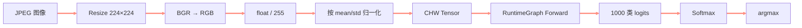
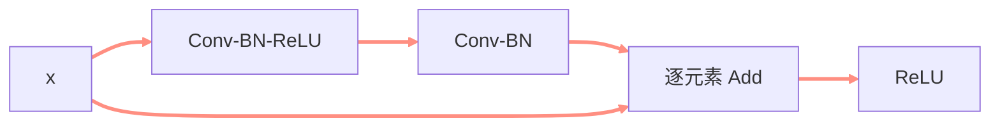

> **课程信息**
> **课程：** 自制深度学习推理框架
> **章节：** ResNet18 端到端图像分类
> **官方视频：** [第八讲 自制推理框架支持 ResNet 网络的推理](https://www.bilibili.com/video/BV1o84y1o7ni)
> **配套源码：** [kuiperdatawhale/course8](https://github.com/zjhellofss/kuiperdatawhale/tree/main/course8)
> **学习状态：** learning


<!-- more -->

## 🎯 本节目标

- [ ] 串起图像预处理、RuntimeGraph、模型前向与后处理。
- [ ] 理解 ResNet 残差连接为什么依赖 Expression Layer。
- [ ] 掌握 AdaptiveAvgPool、Flatten、Linear 和 Softmax 的作用。
- [ ] 能独立定位分类结果的最大概率与索引。

## 🧭 端到端推理流程




**本节要解决的问题：**

> 前七课已经有 Tensor、计算图和若干 Layer，如何把它们组合成一次真实的 ResNet18 图像分类？

---

## 📚 课堂笔记

### 1. 图像预处理必须与训练保持一致

课程测试依次执行：

1. OpenCV 读取 BGR 图像；
2. resize 到 `224×224`；
3. BGR 转 RGB；
4. 转为 `float32`；
5. HWC 三通道拆分并转写到 CHW Tensor；
6. 除以 255；
7. 使用 ImageNet mean/std 按通道归一化。

```cpp
input->data() = input->data() / 255.f;
input->slice(0) = (input->slice(0) - 0.485f) / 0.229f;
input->slice(1) = (input->slice(1) - 0.456f) / 0.224f;
input->slice(2) = (input->slice(2) - 0.406f) / 0.225f;
```

> **> 模型能够运行不代表输入正确。通道顺序、数值范围或归一化参数错误时，程序仍可能输出 1000 个数字，但分类结果没有意义。**

### 2. 构建 RuntimeGraph

```cpp
RuntimeGraph graph(param_path, weight_path);
graph.Build("pnnx_input_0", "pnnx_output_0");
```

`Build` 完成的工作包括：

```text
读取 .pnnx.param / .pnnx.bin
    ↓
建立 RuntimeOperator 与 Operand
    ↓
确定输入输出节点
    ↓
生成拓扑执行顺序
    ↓
按类型创建 Layer
    ↓
准备输入输出 Tensor
```

随后调用：

```cpp
auto outputs = graph.Forward(inputs, true);
```

完成整张网络的顺序执行。

### 3. ResNet 残差连接

残差块的核心是：

$$
y = F(x) + x
$$




这里的 `Add` 正是第 7 课 `pnnx.Expression` 的实际用途：框架解析表达式并把主分支和 shortcut 分支逐元素相加。

### 4. 为完整 ResNet 补齐尾部算子

第 8 课新增或完整接入：

| Layer | 输入到输出 | 作用 |
| --- | --- | --- |
| AdaptiveAvgPool2d | `C×H×W → C×1×1` | 汇聚空间信息 |
| Flatten | `C×1×1 → C` | 展平特征 |
| Linear | `in_features → 1000` | 分类头 |
| Softmax | logits → probabilities | 概率归一化 |

Linear 的核心仍是矩阵乘法：

$$
y = Wx + b
$$

Softmax 为：

$$
p_i=\frac{e^{z_i}}{\sum_j e^{z_j}}
$$

### 5. 输出解释

模型输出长度为 1000。测试先运行 Softmax，再线性扫描：

```cpp
if (max_prob <= prob) {
  max_prob = prob;
  max_index = j;
}
```

本次官方测试结果：

```text
max probability = 0.663738
class index     = 817
```

> [!note]
> 索引 817 只有配合该权重对应的 ImageNet 标签表才能转换为类别名称。本课测试没有加载标签文件，因此笔记只记录索引，不凭空补类别。

### 6. 正确性验证与性能验证要分开

一次完整实验至少回答两个问题：

1. **算得对不对：** 对同一输入比较 KuiperInfer 与 PyTorch 的 logits，记录最大绝对误差、平均绝对误差和 Top-1 是否一致。
2. **跑得快不快：** 在输出已验证正确后，再用统一的 benchmark 条件测量延迟。

公平的 CPU benchmark 必须固定：

| 条件 | 要求 |
| --- | --- |
| 模型与输入 | 相同权重、shape、batch、dtype |
| 运行模式 | `eval` / inference，KuiperInfer 使用 Release |
| 线程 | 固定并记录 PyTorch、OpenMP、OpenBLAS 线程数 |
| 预热 | 两边都先运行若干次 |
| 计时范围 | 只测 Forward，不含 Build、文件读取、预处理和后处理 |
| 单位 | 明确区分 ms/batch、ms/image 和 images/s |

> [!important]
> “C++ 比 Python 快”不是这里的正确解释。PyTorch 的卷积实际会进入 oneDNN/MKL 等高度优化的 C/C++ kernel；最终速度由 kernel、图优化、内存布局、线程调度和硬件后端决定。

本次讨论中，KuiperInfer 从 Debug 下约慢 `60×` 降到 Release 下约慢 `3×`，说明首要问题是编译优化。剩余差距才更适合从 `im2col`、GEMM、线程嵌套、算子融合和中间内存读写中分析。详见 。

---

## 🧪 实践与验证

### 输入图像


### 验证结果

| 检查项 | 结果 |
| --- | --- |
| RuntimeGraph 构建 | 成功 |
| 输入 batch | 1 |
| 输出元素数 | 1000 |
| 最高概率 | 0.663738 |
| 类别索引 | 817 |
| Google Test | 1/1 通过 |

> **验证结论**
> 从 OpenCV 图像预处理到 ResNet18 前向、Softmax 和 argmax 的完整分类链路已经跑通。

---

## 🧠 核心概念

| 概念 | 一句话解释 | 在框架中的用途 | 掌握情况 |
| --- | --- | --- | --- |
| 预处理契约 | 输入格式必须匹配训练阶段 | 保证输出有效 | 🟡 |
| Residual | 主分支结果与 shortcut 相加 | 形成 ResNet 块 | 🟡 |
| AdaptiveAvgPool | 输出空间尺寸固定 | 连接卷积与分类头 | 🟡 |
| Logits | Softmax 前的原始分数 | 表示分类倾向 | 🟡 |
| Argmax | 找到最大概率索引 | 输出最终类别 | 🟡 |

## 🔗 知识联系

```text
Tensor + RuntimeGraph
    ↓
Conv / Pool / ReLU
    ↓
Expression 残差相加
    ↓
AdaptivePool / Flatten / Linear
    ↓
Softmax 分类
```

---

## ⚠️ 易错点

### 1. 忘记 BGR 转 RGB

OpenCV 默认 BGR，而大多数 PyTorch 图像模型按 RGB 训练。

### 2. HWC 数据直接 memcpy 到 CHW Tensor

必须先按通道拆分，并遵循 Tensor 的 rows/cols 内存顺序。

### 3. 把 logits 当概率

logits 不保证非负，也不保证总和为 1；需要 Softmax。

### 4. 只检查程序不崩溃

还要检查输出形状、数值范围、最大概率和参考实现的一致性。

---

## ❓ 待解决问题

- [ ] 加载 ImageNet 标签表，把索引映射为类别名。
- [ ] 与 PyTorch 对同一图片的 logits 做逐元素误差比较。
- [ ] 记录各 Layer 的耗时，定位性能瓶颈。

## 📝 课后自测

### Q1｜为什么 resize、通道顺序和 mean/std 都属于模型的一部分？

>

### Q2｜残差连接在当前框架中由哪个 Layer 完成？

>

### Q3｜从 `graph.Forward` 输出到类别索引还要经过哪些步骤？

>

---

## ✅ 本节总结

1. 真实推理包含预处理、计算图执行和后处理三部分。
2. 前面实现的算子通过 RuntimeGraph 组合成完整 ResNet18。
3. 输出必须结合 Softmax、argmax 和标签表才能成为可解释结果。

**一句话总结：**

> 第 8 课证明了自制框架已不只是单算子实验，而是能够完成真实 CNN 分类模型的端到端推理。

## 🚀 下一步

**下一节：** 

- [ ] 2026-09-02：第一次复习
- [ ] 2026-09-08：第二次复习
- [ ] 2026-10-01：第三次复习
