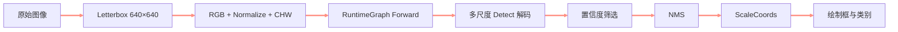
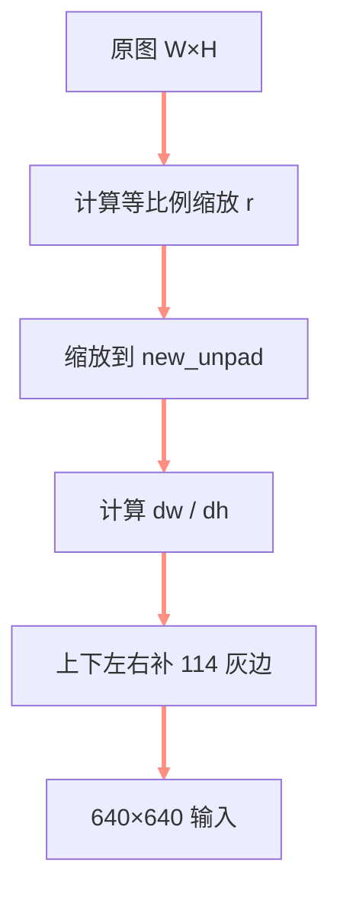
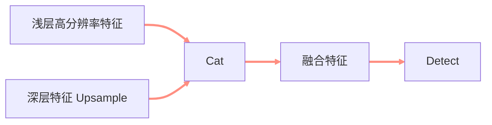

> **课程信息**
> **课程：** 自制深度学习推理框架
> **章节：** YOLOv5 端到端目标检测
> **官方视频：** [第九讲 自制推理框架支持 YOLOv5 网络的推理](https://www.bilibili.com/video/BV1Qk4y1A7XL)
> **配套源码：** [kuiperdatawhale/course9](https://github.com/zjhellofss/kuiperdatawhale/tree/main/course9)
> **学习状态：** learning


<!-- more -->

## 🎯 本节目标

- [ ] 理解 Letterbox 为什么比直接拉伸更适合目标检测。
- [ ] 掌握 YOLOv5 所需的 SiLU、Concat、Upsample 和 Detect。
- [ ] 能解释候选框筛选、置信度计算、NMS 和坐标还原。
- [ ] 跑通从输入图像到带检测框结果图的完整流程。

## 🧭 端到端检测流程




**本节要解决的问题：**

> 分类只输出一个类别，而检测要输出数量不定的边界框。框架如何支持 YOLOv5 的网络结构、检测头和后处理？

---

## 📚 课堂笔记

### 1. Letterbox：等比例缩放并补边

直接 resize 到 `640×640` 会改变物体长宽比。Letterbox 的处理是：




比例：

$$
r=\min\left(\frac{H_{new}}{H},\frac{W_{new}}{W}\right)
$$

补边平均分到两侧，填充值为 `(114,114,114)`。后处理必须使用相同的 `r` 和 padding 把坐标映射回原图。

### 2. 图像到 Tensor

课程测试的输入预处理：

1. Letterbox 到 `640×640`；
2. BGR 转 RGB；
3. 转为 `float32` 并除以 255；
4. split 三通道；
5. 以 CHW 形式写入 `Tensor<float>(3,640,640)`。

与 ResNet 不同，这里没有再做 ImageNet mean/std 标准化。

### 3. YOLOv5 新增算子

| 算子 | 作用 | 实现要点 |
| --- | --- | --- |
| SiLU | `x / (1 + exp(-x))` | 逐元素激活 |
| Upsample | 放大特征图 | 本课支持 nearest |
| Cat | 拼接多路特征 | 沿通道维拼接 |
| YoloDetect | 多尺度预测解码 | grid、anchor、stride |




Cat 的核心是把多个输入 Tensor 的通道数据依次复制到输出：

```cpp
memcpy(output->raw_ptr(start_channel * plane_size),
       input->raw_ptr(),
       sizeof(float) * plane_size * in_channels);
```

### 4. Detect 输出是什么

每个候选预测包含：

```text
[center_x, center_y, width, height, objectness, class_0, class_1, ...]
```

三种尺度的预测结合不同 stride、grid 和 anchor，最后整理为统一输出：

```text
[batch, number_of_candidates, number_of_classes + 5]
```

其中：

- 前 4 项描述边界框；
- 第 5 项是目标存在概率；
- 后续是各类别得分。

### 5. 置信度筛选

测试先检查 objectness：

```cpp
float cls_conf = output->at(b, e, 4);
if (cls_conf >= conf_thresh) {
  // 继续读取位置和类别
}
```

再寻找最佳类别分数，并计算最终置信度：

```cpp
confs.emplace_back(best_conf * cls_conf);
```

即：

$$
confidence = objectness \times class\_probability
$$

### 6. NMS

同一物体周围通常会产生多个高度重叠的候选框。NMS 的步骤：

```text
按置信度选择高分框
    ↓
计算它与其他框的 IoU
    ↓
移除 IoU 超过阈值的低分框
    ↓
重复直到没有候选框
```

本课直接调用：

```cpp
cv::dnn::NMSBoxes(
    boxes, confs, conf_thresh, iou_thresh, indices);
```

IoU 定义：

$$
IoU=\frac{|A\cap B|}{|A\cup B|}
$$

### 7. 坐标还原与绘制

检测框坐标基于 `640×640` Letterbox 图。为了绘制到原图，`ScaleCoords`：

1. 减去 padding；
2. 除以缩放比例 gain；
3. 四舍五入；
4. clip 到原图边界。

最后使用 OpenCV 绘制矩形和类别索引，并写出 `output0.jpg`。

---

## 🧪 实践与验证

### 输入与输出

| 输入图像 | KuiperInfer YOLOv5 输出 |
| --- | --- |
|  |  |

### 运行结果

| 测试 | 结果 |
| --- | --- |
| ResNet 回归测试 | 通过 |
| YOLOv5 端到端测试 | 通过 |
| YOLOv5 耗时（本次测试） | 约 2.6 s |
| 输出文件 | `output0.jpg` |

> **验证结论**
> 第 9 课官方 Google Test 共 **2 项，全部通过**；YOLOv5 成功生成包含检测框和类别索引的结果图。

---

## 🧠 核心概念

| 概念 | 一句话解释 | 在框架中的用途 | 掌握情况 |
| --- | --- | --- | --- |
| Letterbox | 等比例缩放后补边 | 保持物体形状 | 🟡 |
| Multi-scale | 在不同分辨率预测 | 覆盖大小目标 | 🟡 |
| Anchor/Grid | 预测框的空间参考 | 解码位置尺寸 | 🟡 |
| Confidence | objectness × 类别概率 | 筛选候选框 | 🟡 |
| NMS | 抑制高度重叠的低分框 | 去除重复检测 | 🟡 |
| ScaleCoords | 模型坐标映射回原图 | 正确绘制框 | 🟡 |

## 🔗 知识联系

```text
前 1～7 课：框架基础和算子
    ↓
第 8 课：完整分类模型
    ↓
第 9 课：更复杂的多分支检测模型
    ↓
真实 CV 推理工程
```

---

## ⚠️ 易错点

### 1. 直接拉伸图像后仍按 Letterbox 方式还原坐标

预处理与坐标还原必须使用同一几何变换。

### 2. 混淆 objectness 与最终 confidence

最终检测置信度通常还要乘以最佳类别分数。

### 3. 在错误维度执行 Cat

本课实现只支持通道维；空间尺寸必须一致。

### 4. 先缩放框，再减 padding

正确顺序是先去 padding，再除以 gain。

### 5. 只保留框、不保存类别与置信度

NMS 返回的是索引，需要用同一索引同步读取 box、class_id 和 confidence。

---

## ❓ 待解决问题

- [ ] 为输出图绘制 COCO 类别名和置信度。
- [ ] 手写 NMS，与 OpenCV 结果对比。
- [ ] 将预处理、推理和后处理分别计时。
- [ ] 使用 `bus.jpg` 和自选图片测试泛化。

## 📝 课后自测

### Q1｜为什么 Letterbox 之后必须做 ScaleCoords？

>

### Q2｜`[x,y,w,h,obj,classes...]` 中最终 confidence 如何计算？

>

### Q3｜NMS 解决什么问题？IoU 阈值过大或过小分别会怎样？

>

---

## ✅ 本节总结

1. YOLOv5 推理包含网络前向和检测后处理两个同等重要的部分。
2. SiLU、Upsample、Cat 和 Detect 使框架能够执行 YOLOv5 的多尺度结构。
3. Letterbox、置信度筛选、NMS 和坐标还原把原始预测变成可视化检测结果。

**一句话总结：**

> 第 9 课把自制推理框架推进到真实目标检测：从图像输入、模型执行到检测框输出形成完整闭环。

## 🚀 下一步

**下一节：** 

**项目复盘：**

- [ ] 回顾第 1～9 课数据流和对象关系。
- [ ] 给每个核心 Layer 补充单元测试和性能测试。
- [ ] 对照 PyTorch 输出验证数值误差。
- [ ] 开始阅读主仓库的优化实现与更多模型支持。

- [ ] 2026-09-02：第一次复习
- [ ] 2026-09-08：第二次复习
- [ ] 2026-10-01：第三次复习
